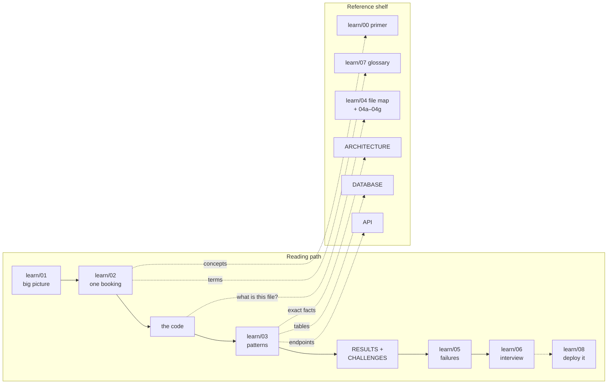

# Tessera docs: start here

There is **one reading path**. Everything else is reference you look things up in.
If a doc feels disconnected, come back to this page and find where it fits.

## The reading path (do this once, in order)

| Step | Read | You come away knowing | Time |
|---|---|---|---|
| 1 | [learn/01 · Big picture](learn/01-level1-big-picture.md) | the one idea (the exclusion constraint) and the 8 services | 15 min |
| 2 | [learn/02 · How it works](learn/02-level2-how-it-works.md) | one booking end to end, with a sequence diagram and the saga state machine. **This is the spine** | 40 min |
| 3 | **The code, following the same booking** (see below) | that the diagrams are real | 1–2 h |
| 4 | [learn/03 · Deep dive](learn/03-level3-deep-dive.md) | every pattern, attached to code you have now seen | 1–2 h |
| 5 | [benchmarks/RESULTS.md](benchmarks/RESULTS.md) + [CHALLENGES.md](CHALLENGES.md) | *why* the design looks like this: measurements, wrong predictions, bugs found | 30 min |
| 6 | [learn/05 · Failure scenarios](learn/05-failure-scenarios.md) | "what if it crashes right here?", for self-testing | 30 min |
| 7 | [learn/06 · Resume & interview](learn/06-resume-and-interview.md) | the pitch, resume bullets, likely questions | 30 min |
| 8 *(when ready)* | [learn/08 · Deployment](learn/08-deployment.md) | how to put it online: one server with HTTPS (recommended), then registry images and Kubernetes | 20 min to read; 1–2 h to deploy |

**Prefer pictures?** Open [`atlas.html`](atlas.html) in a browser: the same story as 8 diagrams on one page.
The same diagrams are embedded as Mermaid in learn/01–03, so GitHub renders them
next to the text.

### Step 3: read the code in the order a booking flows

| # | File | Look at |
|---|---|---|
| 1 | `services/gateway/src/index.js` | the middleware order and `POST /api/reservations` |
| 2 | `services/reservation/src/index.js` | `POST /v1/reservations`: pricing before the transaction, then one idempotent transaction |
| 3 | `services/reservation/src/saga/orchestrator.js` | `#claim`, `#step`, then `#beginHold` → `#beginPayment` → `#beginConfirm`, and `#transitionIn` (CAS) |
| 4 | `services/inventory-engine/src/engine/reserve.js` | steps 1–10 in `reserve()` |
| 5 | `services/inventory-engine/src/engine/confirm.js` | the guarded `UPDATE … AND expires_at > now()` |
| 6 | `services/payment/src/service/payment.service.js` | `charge()` and `resolveUnknown()` |
| 7 | `packages/shared/src/outbox/writer.js` → `relay.js` | how an event leaves the database |
| 8 | `packages/shared/src/consumer/index.js` → `services/notification/src/index.js` | how it is consumed exactly once |

Stuck on a line? The matching line-by-line page is in the
[file map](learn/04-file-map.md).

## Reference shelf (look things up, don't read cover to cover)

| Question | Go to |
|---|---|
| What does this term mean? | [learn/07 · Glossary](learn/07-glossary.md) |
| I don't know this concept at all (transactions, outbox, saga…) | [learn/00 · Concepts primer](learn/00-concepts-primer.md) |
| What does this file do? | [learn/04 · File map](learn/04-file-map.md), then `learn/04a–04g` for line by line |
| Exact architecture facts in one place | [ARCHITECTURE.md](ARCHITECTURE.md) |
| A table, constraint or trigger | [DATABASE.md](DATABASE.md) |
| An endpoint or event shape | [API.md](API.md) |
| How to install and run it | [GETTING_STARTED.md](GETTING_STARTED.md) |
| How to deploy it (one server with HTTPS, a registry, Kubernetes), basic to advanced | [learn/08 · Deployment](learn/08-deployment.md) |
| Long-form interview Q&A | [PROJECT_INTERVIEW.md](PROJECT_INTERVIEW.md) · [HTML guide](interview/tessera-interview-guide.html) |
| Predictions made before measuring | [benchmarks/HYPOTHESES.md](benchmarks/HYPOTHESES.md) |
| History: the original brief and plan (ScaleRail era) | [spec/ORIGINAL_SPEC.md](spec/ORIGINAL_SPEC.md) · [plan/MASTER_PLAN.md](plan/MASTER_PLAN.md) |

## How the docs relate

