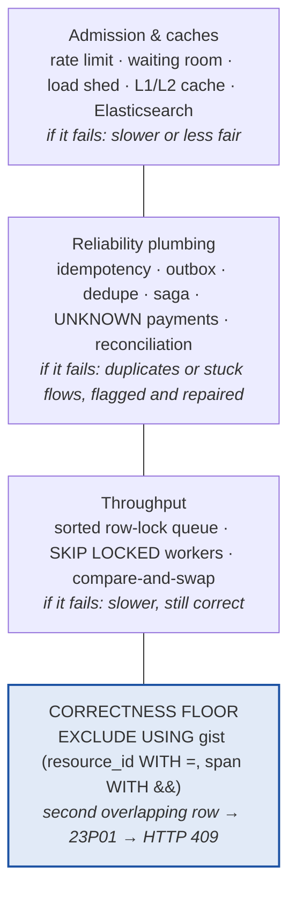
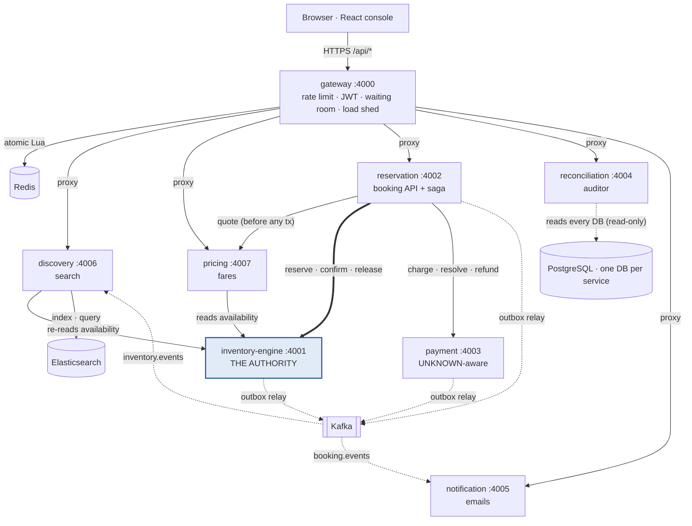

# 01 · Level 1 🟢 — The big picture

> 📍 **Reading path:** **[01 · you are here](01-level1-big-picture.md)** → [02](02-level2-how-it-works.md) → [code](../README.md#step-3-read-the-code-in-the-order-a-booking-flows) → [03](03-level3-deep-dive.md) → [05](05-failure-scenarios.md) → [06](06-resume-and-interview.md) · [Docs home](../README.md)

> Goal of this page: after reading it you can explain Tessera to a friend, a
> recruiter or an interviewer in two minutes, without any code.

---

## 1. One sentence

**Tessera is a booking backend that sells scarce things (train seats, hotel
rooms, concert tickets) to thousands of people at the same moment, and guarantees
it never sells the same thing twice, even when payments time out, servers crash
and messages arrive twice.**

The name: a *tessera* was a Roman entry token. One token, one entry, impossible to
copy.

## 2. The problem, as a story

It's 10:00 AM. The Tatkal (last-minute) booking window opens for the Howrah
Rajdhani. 500 seats. A million people press **Book** in the same second.

Things that go wrong in a naive system:

| What goes wrong | Real-world result |
|---|---|
| Two people "check" a seat is free at the same instant, then both buy it | **Double-booked seat**: two passengers, one berth |
| The payment provider takes the money, but its reply gets lost in the network | Customer **charged, no ticket**. Or, if you retry, **charged twice** |
| The server crashes halfway through "hold seat → pay → confirm" | The seat is stuck held forever, or the payment goes nowhere |
| The "booking confirmed" email message gets delivered twice | Customer gets two emails. Worse: something counts the booking twice |
| A million requests arrive at once | The database melts and **nobody** can book |

Tessera is engineered so that every one of these has a defined, safe outcome.

## 3. The single most important idea

Every kind of inventory is **"a thing, occupied over a stretch"**:

| Domain | The thing | The stretch |
|---|---|---|
| Train | seat | stops 3 → 7 |
| Hotel | room | nights 0 → 3 |
| Concert | seat | the one show |
| Clinic | slot | the one slot |

So "never oversell" becomes one rule: **two live bookings of the same thing must
not overlap.**

Tessera hands that rule to **PostgreSQL itself** (an *exclusion constraint*). The
database **refuses to save** an overlapping booking. It doesn't rely on the code
being careful. Even if every other piece of code had a bug, the database would
still say "no" to the second buyer.

Everything else (Redis, caches, queues, locks) only makes the system **faster or
nicer**. If any of it breaks, the system gets **slower**, not **wrong**.

What each layer is responsible for. Only the bottom one prevents an oversell:

> 🚆 Bonus: because it's a *stretch*, one seat can be sold to Delhi→Kanpur **and**
> Kanpur→Howrah. That is "segment resale", and it falls out of the model for free.

## 4. The pieces (8 small services)

Who talks to whom (solid = HTTP call, dotted = Kafka event, dashed = read-only):

Every service also owns its own PostgreSQL database (not drawn per service, to keep the picture readable).

| Service | Port | In one line |
|---|---|---|
| **gateway** | 4000 | The front door: who are you, are you going too fast, is the system too busy? |
| **inventory-engine** | 4001 | The single source of truth about who holds which seat. |
| **reservation** | 4002 | Takes your booking request and drives it through hold → pay → confirm. |
| **payment** | 4003 | Charges the card. Treats "no answer" as *unknown* and asks the provider instead of guessing. |
| **reconciliation** | 4004 | An auditor that compares all services and flags mismatches. Never touches money on its own. |
| **notification** | 4005 | Sends the "booking confirmed" email exactly once. |
| **discovery** | 4006 | Fast search ("trains Delhi → Howrah tomorrow, 3A, available") from a cached copy. |
| **pricing** | 4007 | Calculates fares on the server. The browser never gets to say what it pays. |

Infrastructure: **PostgreSQL** (one database per service), **Kafka** (the message
bus), **Redis** (rate limits, waiting room, cache), **Elasticsearch** (search),
plus Prometheus, Grafana and Jaeger for monitoring.

## 5. A booking, told simply

1. You **search** "Delhi → Howrah". Discovery answers from a fast cached copy,
   marked "may be a few seconds old".
2. You open the **seat map** and pick seat **B1-23**.
3. You press **Book**. The gateway checks your login and speed limit and forwards
   the request.
4. Reservation asks Pricing for the **real price**, saves your request plus a
   **to-do list** (the *saga*), and replies at once: *"Accepted, follow progress
   here"*.
5. In the background, a worker runs the to-do list one step at a time:
   - **Hold** the seat for 10 minutes. The database decides who wins.
   - **Charge** your card.
   - **Confirm** the seat. Your booking reference `TSR-…` is issued.
6. Your screen polls and shows: *Securing seats → Taking payment → Booked ✓*.
7. An **event** "booking confirmed" goes out. Notification sends your email,
   once, and Discovery updates the search numbers.
8. Every 30 seconds, Reconciliation double-checks that everyone agrees.

**If something fails:**

| Failure | What happens |
|---|---|
| Seat already taken | You get a clear "taken" (409). Nothing to undo. |
| Card declined | The seat is **released** for someone else. |
| Bank doesn't answer | Payment becomes **UNKNOWN**. The system **asks the bank** what happened and never charges again blindly. |
| You paid but your hold expired | **Automatic refund**. Money is never silently kept. |
| A server crashes mid-booking | Another worker picks up the to-do list from where it stopped. |
| Kafka is down | Events wait safely in the database and are sent when Kafka returns. |
| Redis is down | Rate limiting falls back to a local version. Bookings still work. |

## 6. What it *proves*, with real measured numbers

From `docs/benchmarks/RESULTS.md`: one laptop, 1,000 users fighting for 1 seat,
correctness checked by **counting rows in the database** (not by trusting HTTP
responses):

| Approach | People sold the same seat |
|---|---|
| Naive "check then write" | **64** 😱 |
| Tessera's production path (row-lock queue + constraint) | **1** ✅ (0 deadlocks, p99 186 ms) |
| Constraint alone | 1 ✅ but 609 deadlocks, very slow, which is why the row lock was added |
| Redis lock + constraint | 1 ✅. Redis *leaked once*, and the database constraint caught it |

Plus 40 integration tests and 31 end-to-end checks against the running system.

## 7. Why it's worth a place on a resume (short version)

Most student and portfolio projects are CRUD apps. This one shows you understand:

- **Concurrency**: races, locks, deadlocks, and how to *measure* them.
- **Distributed-systems reliability**: outbox, idempotency, sagas, exactly-once
  effects, dead-letter queues.
- **Money safety**: UNKNOWN payment state, webhook security, "never auto-repair
  money".
- **Engineering honesty**: hypotheses written *before* benchmarks, wrong
  predictions published, and limits stated ("K8s not run on a real cluster").

Full resume and interview guide: [06-resume-and-interview.md](06-resume-and-interview.md).

## 8. The five rules to remember

1. **The database is the only authority** on who owns a seat.
2. **No network calls inside a database transaction.**
3. **Never trust a price from the browser.**
4. **A payment timeout means UNKNOWN, never FAILED.**
5. **Money is never fixed automatically**: a human decides.

Next: [02 · How it works (a little deeper) →](02-level2-how-it-works.md)
