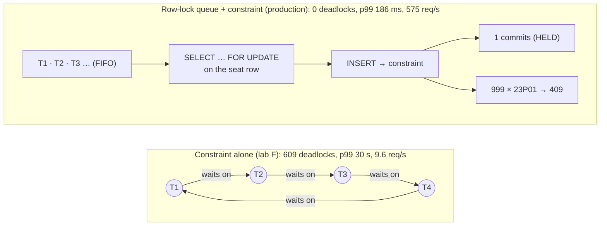
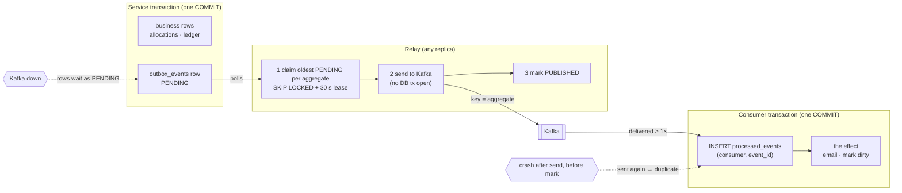
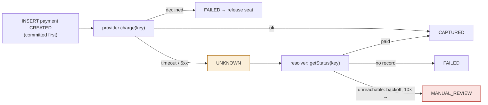
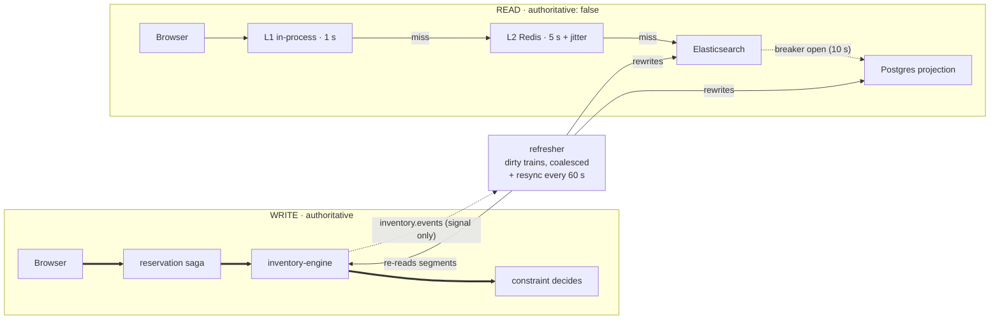

# 03 · Level 3 🔴 — Deep dive into every pattern

> 📍 **Reading path:** [01](01-level1-big-picture.md) → [02](02-level2-how-it-works.md) → [code](../README.md#step-3-read-the-code-in-the-order-a-booking-flows) → **[03 · you are here](03-level3-deep-dive.md)** → [05](05-failure-scenarios.md) → [06](06-resume-and-interview.md) · [Docs home](../README.md)

> Goal: for each advanced technique, understand **the problem**, **the naive
> solution and why it breaks**, **what Tessera does**, **the real code**, and
> **how it is proven**. Read the [primer](00-concepts-primer.md) first if a term is
> new.

## Summary table (memorise this)

| # | Pattern | One-line purpose | Protects [booking step](02-level2-how-it-works.md#4-one-booking-step-by-step-with-names) | Main file |
|---|---|---|---|---|
| 1 | Exclusion constraint + sorted row-lock queue | never oversell, without deadlocks | 4 reserve | `inventory-engine/sql/migrations/010…`, `engine/reserve.js` |
| 2 | Lazy expiry + sweeper | TTL enforced at the moment of contention | 4 reserve | `reserve.js` `reapExpired`, `workers/expiry.worker.js` |
| 3 | Atomic guarded confirm | an expired hold can never be confirmed | 6 confirm | `engine/confirm.js` |
| 4 | Sharded quantity pools | no single hot counter row | 4 reserve | `reserve.js` `claimPool` |
| 5 | Claim-first idempotency | retries can't double-book; lost responses replay | 1–2 create, 3 saga calls | `shared/src/idempotency` |
| 6 | Transactional outbox + relay | an event exists iff its change committed | 7 events | `shared/src/outbox` |
| 7 | Idempotent consumer + seq guard + DLQ + upcasting | effectively-once effects from at-least-once Kafka | 7 events | `shared/src/consumer`, `events/` |
| 8 | Durable orchestrated saga | hold → pay → confirm survives crashes, with compensation | 3 saga | `reservation/src/saga/orchestrator.js` |
| 9 | UNKNOWN payment state + resolver | a timeout never becomes a double charge or lost money | 5 payment | `payment/src/service/payment.service.js` |
| 10 | Secure webhooks | forged/replayed/out-of-order webhooks are harmless | 5 payment | same + `providers/fake.provider.js` |
| 11 | DB-enforced state machines & append-only history | illegal transitions impossible from any code path | 3–6 | the `*_transition_guard` triggers |
| 12 | Ledger + invariant views | correctness is continuously *checked*, not assumed | 4, 6 | `011_ledger…`, `014_ledger_baseline.sql` |
| 13 | Reconciliation | find what everything else missed; never auto-fix money | 8 auditor | `services/reconciliation` |
| 14 | Admission control | survive a flash sale (rate limit, waiting room, load shed) | 1 gateway | `shared/src/admission`, gateway |
| 15 | Read model + multi-level cache + circuit breaker | fast search that may be stale, labelled honestly | 0 browsing | `services/discovery` |
| 16 | Server-side pricing, shared rules | never trust client prices; search = checkout price | 2 create | `shared/src/pricing`, `services/pricing` |
| 17 | Operational shell | timeouts, graceful shutdown, health vs readiness, failpoints, tracing | all | `shared/src/http`, `db/pool.js`, `failpoints` |

---

## 1. Never oversell: exclusion constraint + sorted row-lock queue

### The problem
1,000 requests for seat B1-23 arrive in the same millisecond. Exactly one may win.

### Naive approach (and its failure)
```js
const seat = await db.query('SELECT status FROM seats WHERE id=$1');
if (seat.status === 'AVAILABLE') await db.query("UPDATE seats SET status='HELD' WHERE id=$1");
```
Every request reads `AVAILABLE` before anyone writes. 🧪 Lab strategy A: **64 rows
for 1 seat**.

### Tessera's correctness layer: the constraint
```sql
-- services/inventory-engine/sql/migrations/010_inventory_core.sql
span int4range NOT NULL,                     -- half-open [from, to)
…
ALTER TABLE allocations ADD CONSTRAINT allocations_no_overlap
  EXCLUDE USING gist (resource_id WITH =, span WITH &&)
  WHERE (state IN ('HELD','CONFIRMED','BLOCKED'));
```
- Applications don't check. They just `INSERT`. Postgres guarantees that at most
  one overlapping live row survives. Losers get `23P01`.
- `reserve.js` catches it:
  ```js
  if (isOversellPrevented(err)) {               // err.code === '23P01'
       metrics.oversellPrevented.inc(...);
       throw new ConflictError(`${item.code} is already taken…`, 'RESOURCE_UNAVAILABLE');  // → 409
  }
  ```
- Because spans are ranges, **segment resale** works automatically: `[0,3)` and
  `[3,7)` don't overlap.

### The surprise: correct but collapsing
🧪 Lab strategy F (constraint only): 0 oversells, **but 609 deadlocks out of
1,000**, p99 = 30 s, 9.6 req/s.

**Why?** A unique B-tree index uses *speculative insertion* (check, then insert).
A GiST exclusion constraint **inserts first, then scans for conflicts**, and
*waits* on any conflicting transaction that hasn't finished. With hundreds of
in-flight inserters on one key, they wait on each other in cycles, and Postgres'
deadlock detector starts killing them.

The two designs side by side. Both are correct; only the waiting differs:



### The fix: give contention an orderly queue first
```js
// reserve.js step 3 + 4
resolved.sort((a, b) => a.resourceId === b.resourceId ? a.spanFrom - b.spanFrom
                                                      : a.resourceId.localeCompare(b.resourceId));
const resourceIds = [...new Set(resolved.map(r => r.resourceId))].sort();
await client.query(
  `SELECT id FROM inventory_resources WHERE id = ANY($1::uuid[]) ORDER BY id FOR UPDATE`,
  [resourceIds]);
```
- Requests for the same seat now queue **one at a time, FIFO** on the seat's row
  lock. Each one then inserts with no competing in-flight inserter, and the
  constraint decides cleanly.
- **Sorting** means a request for {A,B} and one for {B,A} lock in the same order, so
  no deadlock cycles across multi-seat bookings either (🧪 integration test:
  opposite-order requests, 0 deadlocks).
- 🧪 Strategy F2: **0 deadlocks, p99 186 ms, 575 req/s (86× faster)**.

### 💡 The architectural claim
> The row lock is a **throughput optimisation**. The constraint is the
> **authority**. If someone forgets the lock in future code, the system gets
> **slow, not wrong**.

The same reasoning applies to Redis (🧪 strategy E): Redis locking was the
fastest (11,364 req/s), **and it leaked once**. The constraint caught the leak.
A distributed lock is a *load filter*, not a *source of truth*.

---

## 2. Time: lazy expiry + sweeper

### Problem
A hold lives 10 minutes. The constraint **can't read a clock**: an expired `HELD`
row still blocks the seat until something flips it to `EXPIRED`.

### Naive approach
Only a background cron job expires holds. If the job is slow or dead, customers
are denied seats that are really free. The background job has become a
**correctness dependency**.

### Tessera
1. **Lazy reap inside reserve** (after locking the rows, before inserting):
   ```sql
   UPDATE allocations SET state='EXPIRED'
    WHERE state='HELD' AND expires_at <= now() AND resource_id = ANY($1)
   RETURNING …
   ```
   plus ledger `EXPIRED +1` entries and closing the parent hold if nothing live is
   left. It touches **only the seats this request wants**, so the cost is
   proportional to the request.
2. **Sweeper** (`expiry.worker.js`): `SELECT … FROM holds WHERE state='ACTIVE' AND
   expires_at <= now() FOR UPDATE SKIP LOCKED LIMIT 200`, all in one transaction. Many
   replicas, no leader. It keeps **availability displays** fresh. If it dies,
   nobody is wrongly refused.
3. **Reads apply expiry in the query**: availability uses `(state <> 'HELD' OR
   expires_at > now())`, so a lapsed hold reads as free immediately.
4. **Database clock**: `expires_at = now() + interval`, so app servers with skewed
   clocks can't extend a hold.
5. **Safety net**: reconciliation check `EXPIRED_HOLD_STILL_ALLOCATED` (auto-repaired,
   because it is inventory-only).

> ⚠️ History note: the old design elected a sweeper *leader* using a session-level
> advisory lock through a connection pool. The unlock could land on a different
> pooled connection, so the lock leaked. SKIP LOCKED needs no leader.

---

## 3. Confirm can never confirm an expired hold

```js
// confirm.js
SELECT … FROM holds WHERE id = $1 FOR UPDATE;                       // serialise vs release/sweeper
if (hold.state === 'CONFIRMED') return { alreadyConfirmed: true };  // idempotent
if (hold.state !== 'ACTIVE') throw ConflictError('HOLD_NOT_ACTIVE');
UPDATE allocations SET state='CONFIRMED', booking_id=$2
 WHERE hold_id=$1 AND state='HELD' AND expires_at > now()           // ← check and act are ONE statement
RETURNING …;
if (confirmed.length + poolClaims.length !== hold.item_count)
    throw new HoldExpiredError('Hold is no longer whole');           // no half-confirmed bookings
```
- There is no gap between "is it still valid?" and "confirm it", because there is
  no separate check.
- **All-or-nothing**: if 1 of 3 seats was reaped, the whole transaction rolls back
  and the saga goes to **refund**.
- Ledger entry `CONFIRMED` with delta **0**: the seat was already unavailable while
  HELD. The entry records the transition, not a capacity change.

---

## 4. Hot counters: bucketed pools

Meals have no seat number, just "200 veg meals". With one row
`UPDATE pool SET held = held+1`, every buyer queues on that row.

```js
// reserve.js claimPool
const start = Math.abs(hashCode(holdId)) % pool.bucket_count;   // spread load; bucket 0 isn't always first
for (let i = 0; i < pool.bucket_count; i++) {
  const bucket = (start + i) % pool.bucket_count;
  UPDATE pool_buckets SET held = held + $3
   WHERE pool_id=$1 AND bucket=$2 AND capacity - held - confirmed >= $3   -- check + claim atomically
  RETURNING …;
  if (row) { INSERT pool_claims …; return; }
}
throw ConflictError('POOL_EXHAUSTED');
```
Plus a DB `CHECK (held + confirmed <= capacity)`, the pool version of the exclusion
constraint. 🧪 Lab G vs G0 (without the CHECK).

---

## 5. Claim-first idempotency

### Problem
The client sends "book", the server books, and the response is lost. The client
retries. Naive servers book **twice**. Even a "check if key exists first" server
has a race: two retries arrive together and both see "no key".

### Tessera (`packages/shared/src/idempotency/index.js`)
```js
// 1. CLAIM atomically (own short transaction, visible to competitors immediately)
INSERT INTO idempotency_keys (scope, key, owner_id, request_hash, state, expires_at)
VALUES (…, 'IN_PROGRESS', now() + 24h)
ON CONFLICT (scope, key) DO NOTHING RETURNING …;

// 2. If someone else owns it, classify:
owner differs           → 422 IdempotencyKeyReuseError   (never leak another user's response)
request_hash differs    → 422                            (same key, different body = bug/attack)
state IN_PROGRESS       → 409 InProgressError (retryable)
otherwise               → REPLAY the stored status + body

// 3. Winner runs business logic AND records the response IN THE SAME TRANSACTION
withTransaction(client => { result = fn(client); complete(client, …COMPLETED, result) })

// 4. On error:
business rejection (4xx, not retryable) → store as FAILED, so retries replay the same 409
infrastructure error (5xx / unknown)    → abandon (DELETE the IN_PROGRESS claim), so an honest retry can run
```
💡 **Why replay rejections?** If a request was refused because the seat was taken,
a retry must get the *same* answer, not a second chance at the inventory.

💡 **Why store the exact response?** "Response fidelity": a retry after a lost
response must see what the original caller *would have* seen.

**Used at two levels:**
- browser → reservation (`scope: 'reservation.create'`, key from the browser)
- saga → inventory (`scope: 'inventory.reserve'`, key `saga:<id>:hold`)

Payment uses the same idea with a `UNIQUE` column (`payments.idempotency_key` +
`ON CONFLICT DO NOTHING`) and passes the key to the provider too.

🧪 e2e: "only ONE allocation exists for the retried request"; "the replay is
marked as such".

---

## 6. Transactional outbox



### Writer: `outbox/writer.js`
```js
async function enqueue(client, args) {          // MUST be the caller's transaction client
  const envelope = createEnvelope({...});        // new event_id (UUID), occurred_at, ids
  validate(envelope);                            // JSON-schema check BEFORE it becomes "fact"
  await client.query(`INSERT INTO outbox_events (…, status, next_attempt_at) VALUES (…, 'PENDING', now())`);
}
async function nextSeq(client, aggregateId) {    // per-aggregate counter, not one global hot row
  INSERT INTO aggregate_sequences (aggregate_id, seq) VALUES ($1, 1)
  ON CONFLICT (aggregate_id) DO UPDATE SET seq = aggregate_sequences.seq + 1 RETURNING seq;
}
```
Every business transaction in inventory (reserve, confirm, release, cancel,
block, unblock, sweep) ends with `nextSeq` + `enqueue`. The event commits **with**
the change.

### Relay: `outbox/relay.js`, three properties
1. **Never lose** → publish **then** mark `PUBLISHED`. A crash in between republishes
   (a duplicate is fine because consumers dedupe). The reverse order would silently
   lose events.
2. **Never hold a DB connection across the network** → claim (short tx) → Kafka
   send (no tx) → mark (short tx).
3. **Per-aggregate order with parallel relays** → the claim only takes the *oldest
   pending row per aggregate*:
   ```sql
   WITH claimable AS (
     SELECT o.id FROM outbox_events o
      WHERE o.status='PENDING' AND o.next_attempt_at <= now()
        AND (o.lease_until IS NULL OR o.lease_until < now())
        AND NOT EXISTS (SELECT 1 FROM outbox_events older
                         WHERE older.aggregate_id = o.aggregate_id
                           AND older.status='PENDING' AND older.id < o.id)   -- head-of-line only
      ORDER BY o.id FOR UPDATE SKIP LOCKED LIMIT $1)
   UPDATE outbox_events o SET lease_owner=$2, lease_until=now()+30s, attempt_count=attempt_count+1
     FROM claimable c WHERE o.id=c.id RETURNING …;
   ```
   Different trains publish in parallel, and one train's events stay strictly in order.

**Failure handling.** Full-jitter backoff (`random(0, min(60s, 100ms·2^attempts))`),
and after 10 attempts the row becomes `DEAD_LETTER`. Kafka being *down* is not an
error: rows just stay `PENDING`. The Kafka producer is created with
`idempotent: true, maxInFlightRequests: 1` (Kafka-side duplicate and reordering
protection).

**Failpoints** prove both crash windows: `outbox.before_publish`,
`outbox.after_publish_before_mark`.

---

## 7. Consumers: effectively-once

`consumer/runner.js` → KafkaJS consumer group → `withDLQ(...)` → service `handle`
→ `createIdempotentHandler`.

```
message ─► JSON.parse ──fail──► dead-letter (MALFORMED_JSON), continue
        ─► validate schema ──fail──► dead-letter (SCHEMA_INVALID)
        ─► upcast to readerVersion[event_type] (e.g. booking.confirmed → v2), validate again
        ─► attempts = bumpAttempts() in DB   (survives restarts/rebalances)
        ─► handle()
              BEGIN
                INSERT processed_events (consumer, event_id) ON CONFLICT DO NOTHING
                   → no row? 'DUPLICATE', stop
                if projection: upsert projection_offsets only if new seq > last_seq
                   → not newer? 'STALE', stop
                handler(client, envelope)     ← the business effect, same tx
              COMMIT
        ─► ok: clear attempts; KafkaJS commits offset afterwards (at-least-once)
        ─► error: attempts < 5 → throw (Kafka redelivers); attempts ≥ 5 → dead-letter, move on
```
- **Notification**: the effect is `INSERT notifications … ON CONFLICT
  (source_event_id, template) DO NOTHING`, a *second* independent dedupe.
- **Discovery**: the effect is only "mark this train dirty". Events are treated as
  **signals, not state**: the refresher always re-reads the authority, so a lost or
  reordered event can't leave search permanently wrong.
- **Replay**: `replayDeadLetters` re-publishes parked messages to their original
  topic. Dedupe makes a replay of a half-succeeded message safe.

**Schema evolution** (`events/registry.js`): `registerSchema(type, version,
schema)` and `registerUpcaster(type, fromVersion, fn)`. Unknown types pass through
(a consumer shouldn't crash on events it doesn't care about). A missing upcaster
step **throws**, because silently handing over a wrongly-shaped payload is worse.

---

## 8. Durable saga orchestrator

### Why not one big HTTP request?
The old design did hold → pay → confirm inside one request. If the pod died after
payment, the money was taken and nothing would ever finish the job.

### Design (`reservation/src/saga/orchestrator.js`)
- The saga is a **row**: `state`, `attempts`, `next_run_at`, `step_deadline_at`,
  `lease_owner/lease_until`, `context` (JSON with everything needed: eventId,
  customerId, items, prices, holdId, paymentId…).
- `tick()` claims due sagas: `FOR UPDATE SKIP LOCKED` + a 60 s lease + `attempts+1`.
- **One step per claim.** The crash window is one step wide, and a slow payment
  parks only that one saga.
- **STEP_POLICY** per state: timeout, max attempts, where to go on timeout.
  ```js
  PAYMENT_PENDING: { timeoutMs: 45_000, maxAttempts: 1 /* never re-charge */, onTimeout: 'PAYMENT_UNKNOWN', indeterminateOnTimeout: true }
  CONFIRM_PENDING: { timeoutMs: 15_000, maxAttempts: 5, onTimeout: 'REFUND_PENDING' }
  ```
- **Deterministic idempotency keys** per step: `saga:<id>:hold`, `:payment`,
  `:confirm`, `:release`, `:refund`.

### Two bugs found by running two workers (and the fixes)
1. **Transitions are compare-and-swap.**
   ```sql
   UPDATE sagas SET state=$2, … WHERE id=$1 AND state=$4   -- $4 = the state I expected
   ```
   0 rows means another worker already moved it. That is a harmless no-op instead
   of an "illegal transition" exception.
2. **`keepLease` across a step.** Moving `CREATED → HOLD_PENDING` happens *before*
   the slow HTTP call. Releasing the lease at that point let a second worker grab the
   same saga mid-call. Now in-progress transitions keep the lease, and only the
   "step finished" transition releases it.

### Compensation
| Failure | Path |
|---|---|
| Hold got 409 | `HOLD_FAILED → COMPENSATED`, reservation `FAILED` ("those seats were taken") |
| Payment declined | `PAYMENT_FAILED → RELEASE_PENDING →` release hold `→ RELEASED → COMPENSATED` (both recorded in one tx so it can't get stuck) |
| Payment error / timeout | `PAYMENT_UNKNOWN →` ask provider with backoff `250ms·2^n` → `AUTHORIZED`/`FAILED`, or after 10 tries `MANUAL_REVIEW` |
| Confirm 409 / hold expired after payment | `REFUND_PENDING →` refund (key `saga:<id>:refund`) `→ COMPENSATED`; refund outcome unknown → `MANUAL_REVIEW` |
| Generic step error | full-jitter reschedule; out of attempts → policy's `onTimeout` target |

### Reservation vs saga
They are separate aggregates. Every terminal saga step also updates the
`reservations` row (`HELD`, `AWAITING_PAYMENT`, `CONFIRMED`, `FAILED`,
`CANCELLED`), in the **same transaction** as the saga transition where possible. A
bug where the saga finished but the reservation stayed `PENDING` forever was found
by the e2e run and fixed (`#settleAndCompensate`).

### Confirm step outputs
In one transaction: `INSERT bookings (… reference 'TSR-'+first 8 chars) ON CONFLICT
(reservation_id) DO NOTHING`, set reservation `CONFIRMED`, enqueue
`booking.confirmed` **v2**, saga → `CONFIRMED`.

---

## 9. Payments: UNKNOWN is a state

```
CREATED ─► AUTHORIZED ─► CAPTURED ─► REFUND_PENDING ─► REFUNDED | PARTIALLY_REFUNDED
   ├─► FAILED (terminal, no way out)
   ├─► CANCELLED
   └─► UNKNOWN ─► AUTHORIZED | CAPTURED | FAILED | CANCELLED     (only via asking the provider)
```


The charge itself is never retried.

`charge()`:
1. `INSERT payments … ON CONFLICT (idempotency_key) DO NOTHING`. If the key exists,
   return the existing payment (**never charge again**).
2. **Committed before** calling the provider (failpoint
   `payment.after_insert_before_charge`).
3. Provider error that is `indeterminate`, `PROVIDER_TIMEOUT` or HTTP ≥ 500 →
   `UNKNOWN` (with `next_resolve_at = now+250ms`). Any other error → `FAILED`.
4. Success → guarded transition `CREATED → CAPTURED`, publish `payment.captured`.

`resolveUnknown()` asks `provider.getStatus({ idempotencyKey })`:
- provider can't be reached → back off (`250ms·2^attempts`, max 5 min). **Never guess.**
- `found: false` → no money moved → `FAILED`.
- otherwise → move to the provider's state.

The **fake provider** keeps its *own* in-memory books, separate from our DB. That is
what makes `getStatus` meaningful, and it can inject `timeout_after_success`,
`error_after_success`, `slow`, `duplicate_webhook`, `out_of_order_webhook`, etc.

**Refunds:** stored as separate rows with their own idempotency key. A DB trigger
`refund_cannot_exceed_payment` blocks refunding more than was paid. A refund whose
outcome is unknown is marked `UNKNOWN` and left for a human. A blind retry could pay
out twice.

---

## 10. Webhooks done safely

Order: **verify → record → act**.
1. The route uses `express.raw()`, because the HMAC must be computed over the **exact
   bytes** received. `JSON.parse` + `stringify` changes key order and whitespace.
2. `HMAC_SHA256(secret, "${timestamp}.${rawBody}")`, compared with
   `timingSafeEqual`, timestamp within ±300 s.
3. **Bad signature** → row in `signature_failures`, 400, and the payment is **not
   touched**. (The old system marked the payment FAILED on a bad signature, so one
   forged request could permanently poison a real payment.)
4. `INSERT provider_events … ON CONFLICT (provider, provider_event_id) DO NOTHING`.
   A duplicate means "already handled", and the reply is still 200 so the provider
   stops retrying.
5. Out of order: an `authorized` arriving after `captured` is skipped explicitly.
6. Transition + outbox event in the same transaction.

---

## 11. State machines and append-only tables in the database

| Trigger | Rule |
|---|---|
| `allocation_insert_guard` | new allocations only `HELD` or `BLOCKED` (migration 012 removed `CONFIRMED`, because confirming must go through a hold and therefore through payment) |
| `allocation_transition_guard` | HELD→{CONFIRMED,EXPIRED,RELEASED,CANCELLED}, CONFIRMED→CANCELLED, BLOCKED→RELEASED; terminal rows get `terminal_at` and `expires_at := NULL` |
| `hold_transition_guard` | ACTIVE → terminal only |
| `saga_transition_guard` | the full arrow table from Level 2 |
| `payment_transition_guard` | no exit from FAILED; UNKNOWN only to a definite state |
| `tessera_append_only()` | `inventory_ledger`, `audit_log`, `saga_steps`, `repair_log` reject UPDATE/DELETE for everyone, including the owner |

Plus CHECK constraints: `held_has_expiry`, `held_has_hold`,
`confirmed_has_booking`, `blocked_has_reason`, `span_not_empty`,
`hold_expiry_after_creation`, `pool_bucket_never_oversold`.

💡 The application *also* checks these rules (for friendly error messages), but the
**database is the wall**. A hand-run SQL fix during an incident hits the same wall.

---

## 12. Ledger and invariants

Every movement appends `(entry_type, delta)`:

| entry | delta |
|---|---|
| CAPACITY_ADDED | +1 (opening balance, written when a seat is created) |
| ALLOCATED | −1 |
| RELEASED / EXPIRED / CANCELLED / UNBLOCKED | +1 |
| CONFIRMED | 0 |
| BLOCKED | −1 |

`invariant_ledger_drift`: for each seat, `sum(delta)` must equal
`1 − count(live allocations)`.

> Bug story (migration 014): at first nothing wrote the **opening balance**, so every
> held seat folded to −1 and "drifted". Correct data was being flagged. The
> accounting was incomplete, and the fix was to backfill `CAPACITY_ADDED`. Also, the
> old view inner-joined the fold, so a seat with **no** ledger rows simply
> disappeared from the check. That is the most important case to catch, so the new
> view drives from `inventory_resources`.

**Invariant views** (all return 0 rows when healthy): I1 overlapping allocations,
I2 oversold pools, I3 expired still held, I3b hold/allocation mismatch, I4 ledger
drift, I7 duplicate bookings, I6 outbox backlog (MEDIUM: "late", not "wrong").
`invariant_summary` rolls them up, and `invariants_for_event(id)` scopes them for
tests. `/admin/invariants` returns 500 only for CRITICAL/HIGH, because a Kafka
outage shouldn't look like data corruption.

---

## 13. Reconciliation: the auditor

8 checks, each with a **grace window** and a **money flag**:

| Check | Grace | Money? | Auto-repair? |
|---|---|---|---|---|
| DUPLICATE_BOOKING | 0 s | yes | no, escalate |
| LEDGER_DRIFT | 60 s | no | no (we don't know which side is wrong) |
| PAYMENT_WITHOUT_BOOKING | 300 s | yes | no, a human decides confirm vs refund |
| CONFIRMED_WITHOUT_PAYMENT | 300 s | yes | no |
| EXPIRED_HOLD_STILL_ALLOCATED | 120 s | no | **yes**: guarded UPDATE + ledger entry |
| PAYMENT_UNKNOWN_TOO_LONG | 600 s | yes | no |
| STUCK_SAGA | 120 s | if in a money state | **yes**: clear lease, run now (never MANUAL_REVIEW) |
| OUTBOX_BACKLOG | 120 s | no | no |

Worker rules:
- **Upsert** issues by `(kind, entity_type, entity_id)`, so the same problem is one
  row with a rising `seen_count`.
- **Repair only after `seen_count ≥ 2`**: one sighting could just be a booking that
  is still in flight.
- Money → `AWAITING_HUMAN` immediately, with a `recommended_action`.
- Issues not seen this pass → `RESOLVED_ITSELF`. This shows the system converging.
- Every repair (auto or human) goes into the append-only `repair_log`. Human actions
  require a reason.
- Reads other DBs through small separate pools (max 3), so the audit never starves
  real traffic.

---

## 14. Admission control: surviving a flash sale

**Token bucket** (`admission/token-bucket.js`), one Lua script:
```lua
tokens = min(capacity, tokens + elapsed * refillRate)
if tokens >= requested then tokens -= requested; allowed = 1
else retryAfterMs = ceil((requested - tokens) / refillRate * 1000) end   -- denied costs NOTHING
HMSET key tokens … updated now; EXPIRE key ttl
```
- Atomic across all gateway instances. Uses `EVALSHA` with the script SHA cached, and
  reloads on `NOSCRIPT` after a Redis restart.
- Redis down → `LocalBucket` (per-instance). **Fails closed**: an approximate limit
  beats no limit.
- Per-route limits: reserve 5 burst / 0.2 per second; search 60 / 2 per second; etc.
- Identity: a hash of the `Authorization` header if present, else the IP.

**Waiting room** (`admission/waiting-room.js`):
- `JOIN_LUA`: `INCR` gives a strictly increasing ticket, stored in a sorted set.
  Rejoining keeps your original place.
- `ADMIT_LUA`: remove expired active sessions, compute free capacity **inside the
  script**, move `min(capacity, drip)` people from the queue to the active set
  (scored by expiry). Five gateways can't over-admit (🧪 test: five concurrent
  instances never exceed the cap).
- Admitted users get an HMAC token `{event, session, expiry}` that is verified
  without Redis and bound to that event.

**Load shedding**: an event-loop lag probe (every 500 ms); the gateway returns 503 if
lag > 500 ms.

**Fairness**: max 6 items per reservation, max 12 concurrently held items per customer.

---

## 15. The read side: discovery



- A consumer marks the train **dirty** (`dirty_events` upsert) in the dedupe
  transaction.
- The refresher (1 s tick) claims ≤10 dirty rows with SKIP LOCKED, re-reads
  `/segment-availability` + stops + events from inventory, **prices every segment
  with the shared fare function**, and rewrites `trips` / `trip_stops` /
  `trip_segments` plus the Elasticsearch documents.
  - **Coalescing**: a train emitting 300 events per second is refreshed at most once
    per tick.
  - Poison handling: a failure means attempts+1 and the row goes to the back of the
    queue. After 5 it is dropped (resync will re-add it if the train still exists).
    A 404 means "the train is gone": it is removed from search.
- A full **resync** every 60 s marks every train dirty, so bulk-seeded trains and
  lost events heal on their own.
- `getSegmentAvailability`: one SQL query for **every (from, to) stop pair × class**
  (28 pairs for 8 stops), using `generate_series` and a CTE of live allocations.
- Search path: **L1** Map (1 s) → **L2** Redis (5 s + 0–2 s jitter) →
  **single-flight** → Elasticsearch (fuzzy station names) → fallback Postgres
  (`word_similarity` trigram). Responses include `backend`, `cache`, `as_of`,
  `ageSeconds`, `authoritative: false`.
- **Versioned cache keys**: `discovery:search:<version>:<sha1(query)>`. Each refresh
  runs `INCR discovery:version`, so every old entry becomes unreachable.
- **Circuit breaker**: an ES error → skip ES for 10 s, then try again.

---

## 16. Pricing

```
fare = round_to_rupee( base × max(0.3, (to − from)/span_max) × tier.multiplier ),  minimum ₹1
tiers by class occupancy:  <50% ×1.0 · <80% ×1.1 · <95% ×1.25 · else ×1.5
```
- One function, `shared/src/pricing.fare()`, used by the pricing service *and* the
  discovery projection, so the search price matches the checkout price.
- The pricing service caches inventory snapshots for 2 s with **single-flight**.
- Reservation calls it **before** opening its transaction and **fails closed**
  (pricing down → 503, nothing is sold at an unknown price).
- The quoted fare is written to `reservation_items.price_cents`, passed through the
  saga context to `allocations.price_cents`, and summed into `holds.total_cents`,
  which is what gets charged.

---

## 17. The operational shell

- **Pool** (`db/pool.js`): max connections, 5 s connection timeout, and
  `statement_timeout=10s`, `lock_timeout=3s`,
  `idle_in_transaction_session_timeout=10s` passed as **startup options**. (Bug
  story: an un-awaited `SET` in a `connect` listener raced the first query.)
  `withTransaction` always releases the connection, even on error.
- **Migrations**: `pg_advisory_lock(4244121)` so several replicas can boot together,
  checksums, one transaction per file, shared SQL applied first (files are ordered by
  filename across directories).
- **HTTP shell** (`http/server.js`): request/correlation/trace ids via
  AsyncLocalStorage, request logs at the right level (5xx error, 4xx debug),
  `/health` (process only), `/ready` (critical vs non-critical dependencies, plus
  draining), `/metrics`, `/_failpoints` (only when enabled), and an error middleware
  that maps `23P01`/`23505` to 409.
- **Graceful shutdown**: draining → wait 3 s → close the server → stop workers
  (release leases) → close pools → exit. An uncaught exception exits so the
  orchestrator restarts a clean process.
- **Failpoints**: `failpoint('name')` is a no-op unless armed. Actions: `crash`
  (`process.exit(9)`, skipping all cleanup), `throw`, `delay`, `drop`.
- **Config**: production refuses to start with dev secrets.
- **Metrics**: conflicts counted separately from errors; `oversell_prevented_total`;
  `invariant_violations` (must stay 0); outbox pending and latency; consumer lag;
  saga transitions; payment unknown count.

Next: [04a · File-by-file: the shared package →](04a-shared-package.md)
