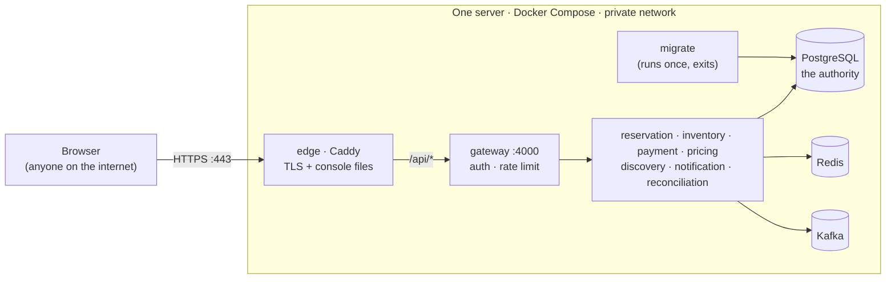
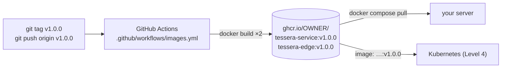
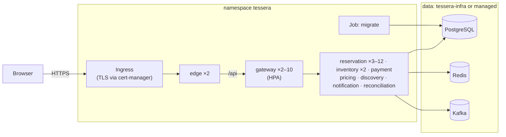

# 08 · Deploying Tessera: from zero to a public URL, then to Kubernetes

> 📍 **Reference page:** read it when you want Tessera running somewhere other than your laptop. Reading path: [01](01-level1-big-picture.md) → [02](02-level2-how-it-works.md) → [code](../README.md#step-3-read-the-code-in-the-order-a-booking-flows) → [03](03-level3-deep-dive.md) → [05](05-failure-scenarios.md) → [06](06-resume-and-interview.md) · [Docs home](../README.md) · [Run it locally first](../GETTING_STARTED.md)

This page goes from "what does deploy even mean" to a Kubernetes rollout, in levels.
Each level builds on the one before, so stop at the level you need.

| You want to… | Go to | Effort | Cost |
|---|---|---|---|
| understand the moving parts before touching a server | [Part 0](#part-0--concepts-you-need-first) | 20 min reading | free |
| try the production setup on your own machine | [Level 1](#level-1--dress-rehearsal-on-your-own-machine) | 15 min | free |
| **put it on the internet with HTTPS (a link for your resume)** | [**Level 2**](#level-2--one-server-on-the-internet-recommended) | 1–2 h | a small VM + optional domain |
| stop building on the server; ship versioned images | [Level 3](#level-3--build-once-deploy-many-images-in-a-registry) | 30 min | free (GitHub) |
| learn Kubernetes with this project | [Level 4](#level-4--kubernetes) | an afternoon | free locally; a cluster costs more |
| know what "production-grade" would still need | [Level 5](#level-5--production-hardening-checklist) | reading | — |

**Recommendation for a portfolio:** Level 2. One server, one `docker compose` command,
automatic HTTPS, about the cost of a coffee or two a month. Kubernetes (Level 4) is
worth learning, but a cluster is more expensive and more fragile than this project
needs to be online.

> ⚠️ **What a deployment of Tessera is, and is not.** It is a working demo: real
> concurrency control, real sagas, real Kafka. It is **not** a shop. The payment
> provider is the built-in fake (no real money can move), and sign-in has no password
> (it is a demo login). Both are explained below, with what you would change for real use.

---

## Part 0 · Concepts you need first

### 0.1 "Deploying" in one picture

On your laptop, `npm run start` runs eight Node processes, and `npm run up` runs the
databases in Docker. Deploying means running the **same programs on a computer that is
always on and reachable from the internet**, with three extra concerns your laptop
never had: **strangers** (security), **restarts** (nothing may be lost), and
**updates** (new code without breaking data).



Only the **edge** is reachable from outside. Everything else talks on a private
network that the internet cannot see.

### 0.2 The vocabulary

| Term | Plain meaning | Where it is in this repo |
|---|---|---|
| **Image** | a frozen, runnable package of a program and everything it needs (like a ZIP that can boot) | `Dockerfile` (all 8 services), `deploy/edge/Dockerfile` (the console + Caddy) |
| **Container** | a running copy of an image | one per service in Compose |
| **Docker Compose** | one YAML file that starts many containers together, in the right order | `deploy/compose/docker-compose.prod.yml` |
| **Volume** | a disk folder that survives container restarts and rebuilds. Databases live here | `postgres_data`, `kafka_data`, `caddy_data`… |
| **Environment variable** | a setting given to a program from outside, e.g. `JWT_SECRET=…` | every `config/index.js` reads them |
| **Secret** | an environment variable that must stay private (passwords, signing keys) | `deploy/compose/.env` (git-ignored) |
| **Migration** | a SQL file that changes the database schema, applied exactly once, in order | `services/*/sql/migrations/`, run by the `migrate` container |
| **Seed** | demo data (trains and seats) loaded into an empty database | `bench/src/seed.js` |
| **Reverse proxy** | the front door: receives every request and forwards it to the right internal program | Caddy, configured by `deploy/edge/Caddyfile` |
| **TLS / HTTPS** | encryption between the browser and the server, via a certificate | Caddy gets a free certificate from Let's Encrypt automatically |
| **DNS A record** | the entry that makes `tessera.yourname.dev` point at your server's IP address | set at your domain registrar |
| **Health / readiness** | `/health` = "the process is alive"; `/ready` = "it can serve traffic now (database reachable…)" | every service, via `packages/shared/src/http/server.js` |
| **Registry** | a place to store images so servers can download them instead of building | GitHub Container Registry (ghcr.io), Level 3 |
| **Kubernetes** | a system that runs containers across many machines and replaces failed ones | `deploy/k8s/`, Level 4 |

### 0.3 Why the production setup looks different from the laptop setup

| Laptop (`docker-compose.yml` + `npm run start`) | Production (`docker-compose.prod.yml`) | Why |
|---|---|---|
| every port is published (5432, 6379, 9092, 4000–4007…) | **only 80 and 443**, on the edge | the internal APIs trust the internal token, not the caller; Postgres must never face the internet |
| dev secrets with defaults (`dev-jwt-secret`) | secrets are **required**, no defaults | with a known JWT secret, anyone can mint an admin token |
| `NODE_ENV` unset | `NODE_ENV=production` | services then **refuse to start** with any dev secret (`packages/shared/src/config/index.js`) |
| you run `npm run migrate` by hand | a `migrate` container runs first; services wait for it | nobody forgets; two servers can't race (advisory lock) |
| failpoints on (`FAILPOINTS_ENABLED=true`) | off | failpoints can crash a process on purpose: a test tool, never a production feature |
| Vite dev server proxies `/api` | Caddy serves the built console and proxies `/api` | same single-origin trick, so no CORS setup is needed in either case |
| operator login `ops@tessera.dev` | **your own unguessable operator email** | sign-in has no password, so the operator email works like a password (see 0.4) |

### 0.4 Two demo shortcuts you must understand before going public

1. **Passwordless sign-in.** `POST /api/auth/login` accepts any email. An address listed
   in `OPERATOR_EMAILS` gets the OPERATOR role: it can block seats, run reconciliation,
   and switch the fake payment provider into failure modes. So on a public server,
   **the operator email is effectively the admin password**. Make it unguessable
   (`ops-3f9c1a7e@yourdomain.dev`) and share it only with people you trust. In
   production mode the gateway refuses to start if `ops@tessera.dev` is still listed,
   and the console stops displaying that hint.
2. **Fake payments.** `PAYMENT_PROVIDER_MODE=ok` makes every charge succeed in an
   in-memory fake provider. Nothing touches a card network. For real money you would
   write a provider adapter and expose the webhook route ([Level 5](#level-5--production-hardening-checklist)).

### 0.5 How much computer does it need?

Measured idle footprints vary, so treat these as planning numbers:

| Part | Rough RAM | Notes |
|---|---|---|
| Kafka (JVM, heap capped at 512 MB) | 600–800 MB | the heaviest required part |
| PostgreSQL | 150–300 MB | grows with data and connections |
| 8 Node services | 60–120 MB each, ~0.7 GB total | |
| Redis, Caddy | < 100 MB together | |
| *Elasticsearch (optional)* | *~1–1.3 GB* | *search falls back to Postgres without it* |

**Minimum: 2 vCPU / 4 GB RAM** without Elasticsearch (add 2 GB of swap as a cushion).
**Comfortable: 4 GB+ with swap, or 8 GB with Elasticsearch.** About 20 GB of disk.

---

## Level 1 · Dress rehearsal on your own machine

Run the exact production stack locally before paying for a server. Every problem you
can hit here, you would otherwise hit on the server with less visibility.

You need Docker Desktop (or Docker Engine) with about 6 GB of memory allowed.

```bash
# 1. Stop the dev stack if it is running (it uses the same ports).
npm run stop; npm run down

# 2. Create the production settings file next to the compose file.
cp deploy/compose/prod.env.example deploy/compose/.env

# 3. Fill in the secrets: one random value each.
for k in POSTGRES_PASSWORD INTERNAL_TOKEN JWT_SECRET WAITING_ROOM_SECRET PAYMENT_WEBHOOK_SECRET; do
  sed -i "s/^$k=.*/$k=$(openssl rand -hex 32)/" deploy/compose/.env
done
# macOS: use  sed -i ''  instead of  sed -i
# then open deploy/compose/.env and set OPERATOR_EMAILS to something private.

# 4. Build and start everything (first build: a few minutes).
docker compose -f deploy/compose/docker-compose.prod.yml up -d --build

# 5. Watch it come up. `migrate` should show "exited (0)"; the rest "running".
docker compose -f deploy/compose/docker-compose.prod.yml ps

# 6. Load demo trains (uses the migrate container's image and settings).
docker compose -f deploy/compose/docker-compose.prod.yml run --rm migrate \
  node bench/src/seed.js --trains 3 --days 2 --stops 8

# 7. Prove it works through the front door only.
npm run smoke -- http://localhost
```

Open <http://localhost>. Sign in with any email to book. Sign in with your
`OPERATOR_EMAILS` address to see the Operations page.

What `npm run smoke` checks (`bench/src/smoke.js`): the console page loads, the
correctness invariants hold, then it signs in as a throwaway customer, books a seat,
waits for `CONFIRMED`, and cancels to release the seat. It uses only public `/api/*`
routes, so it tests the edge, the gateway and the whole saga the way a visitor would.

To stop: `docker compose -f deploy/compose/docker-compose.prod.yml down`
(add `-v` to also delete the data volumes).

---

## Level 2 · One server on the internet (recommended)

### 2.1 Choose where

The steps below are identical on any Linux VM. Provider offers and prices change often,
so check the current pages rather than trusting numbers in a README.

| Kind | Examples | Good to know |
|---|---|---|
| Budget VPS | Hetzner Cloud, DigitalOcean, Akamai/Linode, Vultr | best price for 4–8 GB of RAM; simple dashboards |
| Big cloud VM | AWS EC2 / Lightsail, Google Compute Engine, Azure VMs | more setup, but student credits are common (e.g. the GitHub Student Developer Pack has historically included cloud credits) |
| Free tier | Oracle Cloud "Always Free" Arm instances | generous RAM when capacity is available; ARM CPUs, which work here because the images are built on the server from multi-arch base images |
| PaaS | Render, Railway, Fly.io | **poor fit.** Eight services plus Kafka plus Postgres becomes many billed units, and most offer no Kafka. Fine for one web app, awkward for a distributed system |

Pick **Ubuntu 24.04 LTS**, **≥ 4 GB RAM**, a region near you, and add your **SSH key**
when creating the server.

### 2.2 Lock the doors

Only three ports should be open: 22 (SSH), 80 and 443.

1. In the provider's **cloud firewall** (security group), allow inbound TCP 22, 80, 443
   and UDP 443 (HTTP/3). Deny everything else.
2. On the server:

```bash
ssh root@YOUR_SERVER_IP
adduser deploy && usermod -aG sudo deploy        # work as a normal user, not root
rsync --archive --chown=deploy:deploy ~/.ssh /home/deploy   # reuse your SSH key
ufw allow OpenSSH && ufw allow 80/tcp && ufw allow 443 && ufw enable
# 2 GB of swap: a cushion against memory spikes on a 4 GB machine
fallocate -l 2G /swapfile && chmod 600 /swapfile && mkswap /swapfile && swapon /swapfile
echo '/swapfile none swap sw 0 0' >> /etc/fstab
```

> ⚠️ Docker writes its own firewall rules, and a port published by Docker is reachable
> **even if ufw blocks it**. That is why the production compose file publishes only 80
> and 443, and why the cloud firewall in step 1 matters.

### 2.3 Install Docker and get the code

```bash
ssh deploy@YOUR_SERVER_IP
curl -fsSL https://get.docker.com | sudo sh       # Docker Engine + Compose plugin
sudo usermod -aG docker $USER && exit              # log out and back in to apply
ssh deploy@YOUR_SERVER_IP
docker compose version                             # should print v2.x

git clone https://github.com/X-Rachit-X/Distributed-Inventory.git tessera
cd tessera
```

### 2.4 Configure

```bash
cp deploy/compose/prod.env.example deploy/compose/.env
for k in POSTGRES_PASSWORD INTERNAL_TOKEN JWT_SECRET WAITING_ROOM_SECRET PAYMENT_WEBHOOK_SECRET; do
  sed -i "s/^$k=.*/$k=$(openssl rand -hex 32)/" deploy/compose/.env
done
nano deploy/compose/.env      # set OPERATOR_EMAILS; leave SITE_ADDRESS=:80 for now
```

Every variable in that file is explained by comments next to it. The rules:
**hex-only passwords** (they are embedded in database URLs, where `@ : / #` break
parsing), **never commit** this file (it is git-ignored), and **back it up** somewhere
safe: losing `POSTGRES_PASSWORD` locks you out of your own data volume.

### 2.5 Start, seed, verify

```bash
docker compose -f deploy/compose/docker-compose.prod.yml up -d --build
docker compose -f deploy/compose/docker-compose.prod.yml ps
docker compose -f deploy/compose/docker-compose.prod.yml run --rm migrate \
  node bench/src/seed.js --trains 3 --days 2 --stops 8
```

From your **laptop** (it has Node), run the smoke test against the server:

```bash
npm run smoke -- http://YOUR_SERVER_IP
```

What happened, in order: Compose built the two images on the server, started
Postgres and created the six databases (`deploy/compose/init/postgres`), started
Kafka and created the topics with fixed partition counts, ran every migration in the
`migrate` container, and only then started the eight services and the edge.

### 2.6 A domain and HTTPS

1. Get a domain (any registrar), or a free subdomain from a dynamic-DNS service.
2. Add an **A record**: `tessera.yourdomain.dev → YOUR_SERVER_IP`. Wait until
   `dig +short tessera.yourdomain.dev` prints your IP (minutes, sometimes longer).
3. In `deploy/compose/.env` set `SITE_ADDRESS=tessera.yourdomain.dev`.
4. Recreate only the edge:

```bash
docker compose -f deploy/compose/docker-compose.prod.yml up -d edge
docker compose -f deploy/compose/docker-compose.prod.yml logs -f edge   # watch the certificate being issued
```

Caddy asks Let's Encrypt for a certificate, proves it controls the domain over port 80,
stores the certificate in the `caddy_data` volume, and renews it before expiry. Plain
`http://` requests are redirected to `https://`. Run the smoke test again with the
`https://` address.

### 2.7 Day two: operating it

| Task | Command (from `~/tessera`) |
|---|---|
| Shorten the commands | `alias dc='docker compose -f deploy/compose/docker-compose.prod.yml'` (add to `~/.bashrc`) |
| Status | `dc ps` · `docker stats` (live CPU/RAM per container) |
| Logs | `dc logs -f gateway` · `dc logs --since 10m reservation` (logs are JSON, rotated at 5 × 10 MB per container) |
| Correctness at a glance | `curl -s https://YOUR_DOMAIN/api/ops/invariants` and the console's Correctness page |
| **Deploy a new version** | `git pull && dc up -d --build`: rebuilds, **runs new migrations first**, then replaces the containers. Expect a few seconds of errors while containers restart; zero-downtime needs Level 4 |
| Restart one service | `dc restart reservation` (sagas in flight resume: their state is in Postgres) |
| Stop everything (keep data) | `dc down` · **delete data too:** `dc down -v` ⚠️ |
| Free disk from old builds | `docker image prune -f && docker builder prune -f` |

**Backups.** Everything that matters is in PostgreSQL (Kafka and Redis can be
rebuilt). A nightly logical backup:

```bash
mkdir -p ~/backups
cat > ~/backup.sh <<'EOF'
#!/bin/sh
cd ~/tessera && docker compose -f deploy/compose/docker-compose.prod.yml exec -T postgres \
  pg_dumpall -U tessera --clean --if-exists | gzip > ~/backups/tessera-$(date +%F).sql.gz
find ~/backups -name 'tessera-*.sql.gz' -mtime +14 -delete    # keep two weeks
EOF
chmod +x ~/backup.sh
(crontab -l 2>/dev/null; echo "15 3 * * * $HOME/backup.sh") | crontab -
```

A backup on the same disk as the database does not survive the disk. Copy
`~/backups` off the server too (your provider's object storage, `rclone`, or `scp` to
your machine). To restore: `dc stop` all application containers, start `postgres`,
then pipe the file in:

```bash
dc stop && dc start postgres
gunzip -c ~/backups/tessera-2026-10-01.sql.gz | \
  docker compose -f deploy/compose/docker-compose.prod.yml exec -T postgres psql -U tessera -d postgres
dc up -d
```

Rehearse a restore once on a scratch server before you need it. This procedure has
not been drilled on this repo yet.

**Rolling back.** Code rolls back with `git checkout <previous-tag> && dc up -d --build`.
**Migrations only go forward.** If a new migration changed data, rolling back the code
does not undo it: restore the backup taken before the upgrade. That is the reason to
take one right before every deploy (`~/backup.sh && git pull && dc up -d --build`).

### 2.8 Troubleshooting

| Symptom | Cause → fix |
|---|---|
| `required variable JWT_SECRET is missing a value` | `deploy/compose/.env` is missing or not next to the compose file. Compose reads `.env` from the compose file's directory |
| gateway exits: `OPERATOR_EMAILS must not include ops@tessera.dev in production` | working as intended: set your own operator email |
| a service exits: `X must be set to a real secret in production` | a secret still has its dev value; regenerate it |
| `migrate` exits non-zero | `dc logs migrate`. Usually Postgres not ready yet (re-run `dc up -d`) or a wrong `POSTGRES_PASSWORD` for an existing volume (the password is fixed when the volume is first created) |
| `/api/...` returns 502 | the gateway isn't running or ready: `dc ps`, `dc logs gateway` |
| console loads, every booking stays "Securing your seats" | the saga needs inventory and payment: `dc logs reservation inventory payment` |
| certificate not issued | DNS doesn't point here yet, or port 80 is blocked (Let's Encrypt validates over 80) |
| containers restart randomly, `dmesg` shows "Out of memory" | too little RAM: add swap, drop Elasticsearch, or resize the server |
| Elasticsearch exits mentioning `vm.max_map_count` | `sudo sysctl -w vm.max_map_count=262144` (persist it in `/etc/sysctl.conf`) |

---

## Level 3 · Build once, deploy many: images in a registry

In Level 2 the server builds the images itself. That is simple, but every server
rebuilds, two servers could end up with different builds, and "roll back" means
rebuilding old code. The professional pattern is: **CI builds an image once, gives it
a version tag, and every server pulls that exact image.**



1. **Publish.** In GitHub: *Actions → Publish images → Run workflow*, or push a tag:
   `git tag v1.0.0 && git push origin v1.0.0`. The workflow builds
   `ghcr.io/<owner>/tessera-service` and `ghcr.io/<owner>/tessera-edge` (owner
   lower-cased), tagged with the version, the commit (`sha-…`) and `latest`.
2. **Access.** New packages on ghcr.io are private. Either make them public (package
   page → *Package settings → Change visibility*), or on the server log in with a
   personal access token that has `read:packages`:
   `echo $TOKEN | docker login ghcr.io -u YOUR_GITHUB_USER --password-stdin`.
3. **Use them.** In `deploy/compose/.env`:

```bash
TESSERA_IMAGE=ghcr.io/<owner>/tessera-service:v1.0.0
TESSERA_EDGE_IMAGE=ghcr.io/<owner>/tessera-edge:v1.0.0
```

```bash
dc pull && dc up -d --no-build      # --no-build: never fall back to building on the server
```

Upgrading is now "change the tag, pull, up". Rolling back is "change it back". The
server no longer needs the source code except for the compose file, `.env` and
`deploy/compose/init/`.

**Next step in CI (not set up here):** a workflow that runs `npm test` on every pull
request needs PostgreSQL and Redis as GitHub Actions *service containers*; the tests
expect the same `.env` variables as local runs.

---

## Level 4 · Kubernetes

### 4.1 The same system, in Kubernetes words

| In Compose (Level 2) | In Kubernetes | File |
|---|---|---|
| one service block × 8 | a **Deployment** (keeps N copies running) + a **Service** (stable internal name) | `deploy/k8s/base/<service>.yaml` |
| `migrate` container | a **Job** (runs to completion once) | `base/migrate-job.yaml` |
| `.env` secrets | a **Secret** | generated per overlay; keys in `base/secret.example.yaml` |
| shared non-secret settings | a **ConfigMap** | `base/configmap.yaml` |
| edge with ports 80/443 | edge Deployment + an **Ingress** (the cluster's front door) | `base/edge.yaml`, `base/ingress.yaml` |
| `restart: unless-stopped` | probes: **liveness** `/health` restarts a stuck process; **readiness** `/ready` removes it from traffic | in every Deployment |
| "a few seconds of errors during deploys" | **rolling updates** (`maxUnavailable: 0`) + graceful shutdown: zero-downtime | Deployment `strategy` |
| one copy of each | **HorizontalPodAutoscaler** (more copies under CPU load) and **PodDisruptionBudget** (keep a minimum during node maintenance) | `base/hpa.yaml`, `base/pdb.yaml` |
| volumes | **PersistentVolumeClaims** | `deploy/k8s/infra/` |

Why horizontal scaling is safe here: **correctness lives in PostgreSQL**, not in any
service's memory. Workers claim sagas and outbox rows with `FOR UPDATE SKIP LOCKED` and
leases, so ten replicas split the work without a leader, and the exclusion
constraint still decides every seat ([03 §1](03-level3-deep-dive.md)).



> **Status, honestly:** these manifests build with `kubectl kustomize` and pass
> `kubeconform -strict`, but they have not been applied to a running cluster. Treat
> your first run as a test, and expect to fix something small.

### 4.2 A local cluster with kind (learning, free)

You need Docker, [`kind`](https://kind.sigs.k8s.io/) and `kubectl`, and about 6 GB of
memory for Docker.

```bash
# 1. A cluster: Kubernetes nodes running as Docker containers.
kind create cluster --name tessera

# 2. Build the two images and copy them into the cluster (no registry needed).
docker build -t tessera/service:dev .
docker build -f deploy/edge/Dockerfile -t tessera/edge:dev .
kind load docker-image tessera/service:dev tessera/edge:dev --name tessera

# 3. Data services (single replica, learning only).
cp deploy/k8s/infra/secrets.env.example deploy/k8s/infra/secrets.env
kubectl kustomize --load-restrictor LoadRestrictionsNone deploy/k8s/infra | kubectl apply -f -
kubectl -n tessera-infra rollout status statefulset/postgres
kubectl -n tessera-infra rollout status statefulset/kafka
kubectl -n tessera-infra wait --for=condition=complete job/kafka-topics --timeout=300s

# 4. The application. Its database URLs must use the same password as step 3.
cp deploy/k8s/overlays/local/secrets.env.example deploy/k8s/overlays/local/secrets.env
kubectl apply -k deploy/k8s/overlays/local
kubectl -n tessera wait --for=condition=complete job/migrate --timeout=300s
kubectl -n tessera get pods        # all Running and READY 1/1 after a minute or two

# 5. Demo data, run inside an existing pod (it has the settings already).
kubectl -n tessera exec deploy/inventory -- node bench/src/seed.js --trains 3 --days 2 --stops 8

# 6. Open it. No ingress controller needed locally: forward a port to the edge.
kubectl -n tessera port-forward svc/edge 8080:80
npm run smoke -- http://localhost:8080        # in another terminal
```

Things worth trying once it runs (this is where Kubernetes teaches you something):

- `kubectl -n tessera delete pod -l app=reservation` mid-booking: the Deployment
  replaces the pod, and the saga continues from its row in Postgres.
- `kubectl -n tessera scale deploy/reservation --replicas=3`, then book: three workers,
  disjoint work, no double processing.
- `kubectl -n tessera rollout restart deploy/gateway` while the smoke test loops:
  readiness and graceful shutdown keep requests flowing.
- `kubectl -n tessera logs -f deploy/reservation` and `kubectl -n tessera describe pod …`
  when something is not Ready.

Clean up: `kind delete cluster --name tessera`.

### 4.3 A real cluster

The shape is the same; three things change.

**1. Data services become managed.** Don't run your only copy of the database as a
single pod. Use a managed service and point the Secret and ConfigMap at it.

| Need | Managed options (examples) | Notes for Tessera |
|---|---|---|
| PostgreSQL 16 | AWS RDS / Aurora, Google Cloud SQL, Azure Database for PostgreSQL, Neon, Supabase | needs the extensions `btree_gist` (the exclusion constraint), `pgcrypto`, `pg_trgm`: check the provider supports them. Run `deploy/compose/init/postgres/01-databases.sql` once with `psql` to create the six databases |
| Redis 7 | ElastiCache, Memorystore, Azure Cache, Upstash | cache, rate limits, waiting room; never an authority |
| Kafka | Confluent Cloud, Amazon MSK, Redpanda Cloud, Aiven | set `KAFKA_SSL=true`, `KAFKA_SASL_MECHANISM`, `KAFKA_SASL_USERNAME`, `KAFKA_SASL_PASSWORD` (read by `packages/shared/src/config/kafka.js`); create the topics with `create-topics.sh` (`BOOTSTRAP=...`) and **replication factor 3** |

Count database connections before you scale: every pod opens up to its pool size (`DB_POOL_MAX`:
20 for inventory and reservation, 10 for payment). With 12 reservation replicas, that is
240 connections from one service alone. Managed Postgres plans cap connections, so
either size the plan, lower the pool sizes, or put PgBouncer in front.

**2. Images come from the registry (Level 3)**, and the Secret comes from a secret
manager: [External Secrets Operator](https://external-secrets.io/), Sealed Secrets, or
your cloud's secret store. The minimum is a one-off command (never commit the file):

```bash
kubectl create namespace tessera
kubectl -n tessera create secret generic tessera-secrets --from-env-file=prod-secrets.env
```

**3. The front door.** Install an ingress controller (Traefik is a common, maintained
choice; cloud providers ship their own. The widely used community ingress-nginx
controller was announced for retirement in late 2025, so check its status before
picking it) and [cert-manager](https://cert-manager.io/) with a `ClusterIssuer` named
`letsencrypt`. Then edit `deploy/k8s/overlays/production/kustomization.yaml`: image
owner and tag, your domain, your IngressClass. Then:

```bash
kubectl apply -k deploy/k8s/overlays/production
kubectl -n tessera wait --for=condition=complete job/migrate --timeout=300s
kubectl -n tessera rollout status deploy/reservation
```

**Upgrades:** change the image tag in the overlay, delete the finished Job (its template
is immutable), apply, wait for the new migration, then watch the rollout:

```bash
kubectl -n tessera delete job migrate --ignore-not-found
kubectl apply -k deploy/k8s/overlays/production
kubectl -n tessera wait --for=condition=complete job/migrate --timeout=300s
kubectl -n tessera rollout status deploy/gateway
kubectl -n tessera rollout undo deploy/gateway     # if something looks wrong
```

Managed Kubernetes options include GKE (Autopilot), Amazon EKS, Azure AKS, DigitalOcean
Kubernetes, or k3s on your own VMs. A cluster's control plane, load balancer and the
managed data services add up quickly. This is why Level 2 is the recommendation for a
demo.

---

## Level 5 · Production hardening checklist

What separates "deployed" from "production-grade", roughly in the order it matters.
None of this is needed for a portfolio demo. All of it is good interview material
("what would you do before real users?").

**Data safety**
- [ ] Automated backups **with point-in-time recovery** (managed Postgres gives this), and a restore drill on a calendar.
- [ ] Postgres high availability (a standby that takes over), not a single instance.
- [ ] Kafka with 3 brokers, topics at replication factor 3, `min.insync.replicas=2` (`REPLICATION` in `create-topics.sh` is 1 for one broker).

**Security**
- [ ] Real authentication: an identity provider (OIDC: Auth0, Cognito, Keycloak…) instead of the passwordless demo login; roles from the token's claims, not `OPERATOR_EMAILS`.
- [ ] Secrets from a secret manager, rotated. Rotating `JWT_SECRET` signs everyone out; `INTERNAL_TOKEN` must change on all services together.
- [ ] Network policies so only the gateway can call the other services, and TLS between services (a service mesh, or mTLS).
- [ ] Dependency and image scanning in CI. `npm audit` currently reports advisories; review them before going live.
- [ ] Rate limits tuned to real traffic. The gateway trusts `X-Forwarded-For` only from private-network hops (`TRUST_PROXY`, see `packages/shared/src/http/server.js`). If your load balancer has public addresses, set `TRUST_PROXY` to the number of proxies in front.

**Real payments** (only if this ever took money)
- [ ] A provider adapter implementing `charge`, `getStatus` and `refund` against a real PSP, in place of `FakeProvider`.
- [ ] Expose `POST /webhooks/provider` publicly (the edge routes only `/api/*` today); keep the HMAC and timestamp checks.
- [ ] PCI scope: never let card data touch these services (use the provider's hosted fields or checkout).

**Observability**
- [ ] Metrics: Prometheus scrapes `/metrics` on every service (the k8s pods carry `prometheus.io/*` annotations); the Grafana dashboard is in `deploy/grafana/dashboards/tessera.json`.
- [ ] Alerts that mean something: `tessera_invariant_violations > 0` (page someone), `tessera_outbox_pending` growing for 5+ minutes, `tessera_payment_unknown > 0` for 10+ minutes, `tessera_saga_stuck > 0`, open CRITICAL reconciliation issues, `/ready` failing.
- [ ] Traces: set `OTEL_EXPORTER_OTLP_ENDPOINT` to an OpenTelemetry collector.
- [ ] Central logs (Loki, CloudWatch, Cloud Logging); the services already log JSON with correlation ids.

**Capacity**
- [ ] Load-test with `bench/k6/flash-sale.js` against a staging copy before launch. It is written but has never been run, so its numbers don't exist yet ([CLAUDE.md](../../CLAUDE.md) rule 11).
- [ ] Consumers scale only up to their topic's partition count (6 for `inventory.events`).
- [ ] Database connection budget (4.3) before raising replica counts.

---

## What has been verified, and what has not

| Piece | How it was checked | Status |
|---|---|---|
| Services in `NODE_ENV=production` with generated secrets | fresh PostgreSQL initialised by `deploy/compose/init/postgres`, `migrate-cli` on empty databases, seed, all 8 services started | ✅ all `/ready` 200 |
| Edge config | the **real Caddy binary** with `deploy/edge/Caddyfile` (web root pointed at the build): SPA routes, `/api` proxy, cache and security headers | ✅ |
| Full path through the edge | `npm run smoke` | ✅ 9/9 |
| Business behaviour in production mode | `npm run e2e` against the production-mode services, without Elasticsearch | ✅ 39/39 |
| Console production build | `npm ci` + `vite build` exactly as `deploy/edge/Dockerfile` runs them | ✅ (after the lockfile fix below) |
| Production safety checks | dev secrets and `ops@tessera.dev` refused; spoofed `X-Forwarded-For` ignored from public addresses | ✅ |
| `docker-compose.prod.yml` | `docker compose config` with and without secrets | ✅ valid; ⚠️ **not yet run as containers**: the authoring sandbox could not pull base images (registry access blocked), so your first `up --build` is the first container run |
| Kubernetes manifests | `kubectl kustomize` (all overlays + infra) + `kubeconform -strict` | ✅ valid; ⚠️ not applied to a cluster |
| `images.yml` workflow | YAML parses | ⚠️ not run yet; it runs on your first manual trigger or tag |
| Kafka TLS/SASL settings | unit-checked option building; plain-text path covered by tests and e2e | ⚠️ not exercised against a managed broker |

**Fixed while writing this guide** (each would have broken a deployment):
- `package-lock.json` was generated on Windows and recorded only the Windows builds of
  Rollup and esbuild (npm bug [npm/cli#4828](https://github.com/npm/cli/issues/4828)),
  so `npm ci` on Linux (Docker, CI, any server) could not build the console. The
  missing platform entries were added; no versions changed.
- The gateway believed any `X-Forwarded-For` header (`trust proxy: true`), so a client
  could send a new fake IP with each request and never hit the per-IP rate limit. It
  now trusts the header only from private-network hops.
- Production accepted the public operator email `ops@tessera.dev`, which with
  passwordless sign-in made anyone an operator. It is now refused, and the console no
  longer shows it outside development.
- The Kubernetes base applied a placeholder Secret (`replace-me`), which production mode
  would have accepted; it lacked `OPERATOR_EMAILS`; and it pointed search at an
  Elasticsearch that the manifests never deploy.

Next: back to the [docs home](../README.md) · glossary of terms in [07](07-glossary.md)
